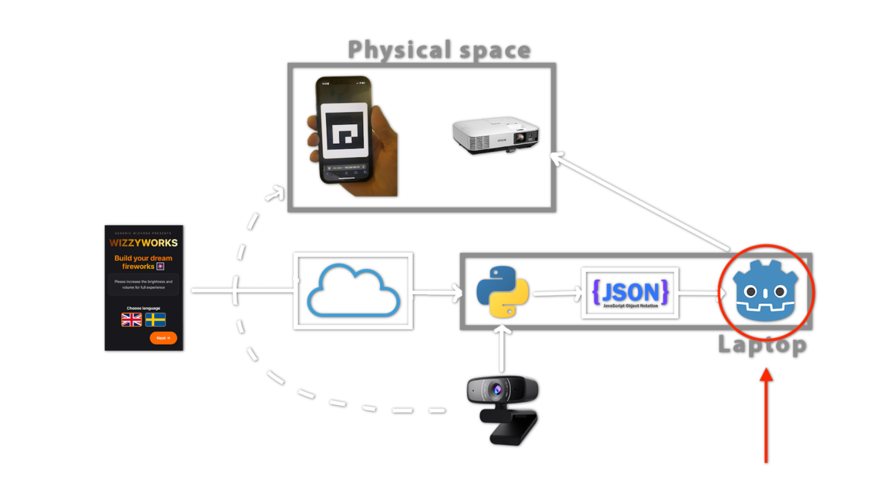

# WizzyWorks Graphics

The graphical component of the WizzyWorks project for DH2413 Advanced Graphics and Interaction in KTH, 2025. This module renders firework visualizations based on JSON configuration data and PNG images.

It is intended for this system to run alongside other components for the WizzyWorks project, as shown in the diagram below. This WizzyWorks Graphics is a Godot-based visualization engine that reads firework data from JSON files and corresponding PNG images to create and display dynamic firework shows. 



## Features

- **Dynamic Firework Creation**: Reads JSON configuration files and PNG images from `json_fireworks/` directory to generate custom fireworks
- **Firework Show System**: Orchestrates firework displays with music synchronization using previously fired fireworks
- **Multiple Firework Types**: Supports various firework patterns including chrysanthemum, willow, cluster, sphere, and custom drawing-based fireworks
- **Interactive Controls**: Keyboard controls for loading, firing, and managing firework shows

## Requirements

- [Godot Engine 4.4+](https://godotengine.org/)

## Project Structure

```
godot-visuals/
├── scenes/
│   ├── testing_environment.tscn  # Main scene
│   ├── firework_show.tscn        # Firework show orchestrator
│   └── [various firework types]
├── scripts/                       # Game logic and controllers
├── json_fireworks/
│   ├── firework_drawings/        # PNG image files
│   ├── json_firework_shows/      # Show configuration files
│   ├── firework_shows/           # Another show configuration files
│   ├── permanent_firework/       # Permanent firework data
│   └── processed/                # Processed fireworks
└── assets/                        # Audio and other assets
```

## How to Run

1. **Install Godot Engine 4.4 or later**
   - Download from [godotengine.org](https://godotengine.org/)

2. **Open the Project**
   ```bash
   cd wizzyworks-graphics/godot-visuals
   ```
   - Launch Godot Engine
   - Click "Import" and select the `godot-visuals` folder
   - Open `project.godot`

3. **Run the Main Scene**
   - Open `scenes/testing_environment.tscn`
   - Press F5 or click the "Play" button

## Keyboard Controls

| Key | Action |
|-----|--------|
| `F` | Load firework from JSON |
| `M` | Generate mock fireworks |
| `L` | Load fixed firework show |
| `S` | Stop firework show |
| `N` | Skip to next firework in show |
| `D` | Toggle debug mode |

## Data Integration

This component expects firework data (JSON + PNG) to be placed in the `json_fireworks/` directory. These files are generated by other components of the WizzyWorks project:

- **JSON files**: Define firework parameters, timing, and behavior
- **PNG files**: Provide visual patterns for drawing-based fireworks
- **Show files**: Define sequences of fireworks synchronized with music cues
